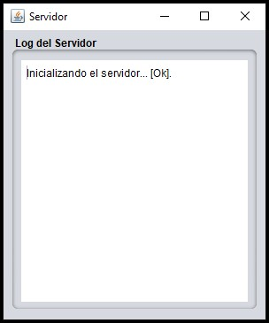
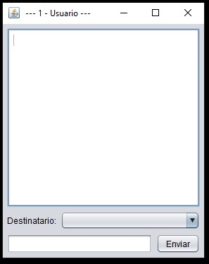
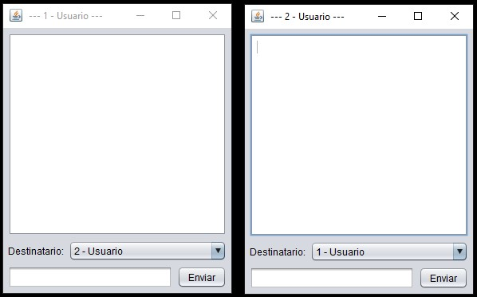
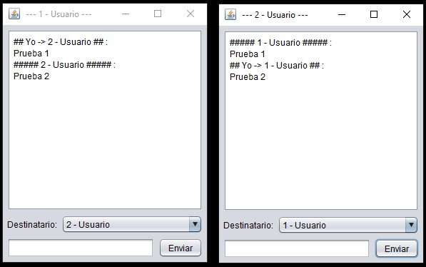
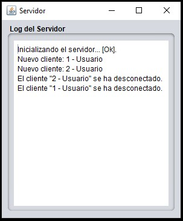

# Java Multithreaded Chat Client-Server

A client-server chat application developed in Java using sockets, multithreading, object streams, and a graphical user interface built with Java Swing.

The project implements a basic real-time communication system where multiple clients can connect to a server, identify themselves, view connected users, and exchange messages through a graphical interface.

## Description

This project demonstrates the implementation of network communication between a server and multiple clients using Java sockets.

The server listens for incoming connections on a configurable port. Each connected client is handled by an independent thread, allowing multiple clients to communicate with the server concurrently.

The client application provides a graphical interface where users can:

* Connect to a server.
* Enter a username.
* View connected users.
* Select a message recipient.
* Send messages.
* Receive messages from other clients.
* Disconnect from the chat.

The server application provides a graphical interface that displays a log of connection and disconnection events.

## Features

* Client-server communication using TCP sockets.
* Multiple simultaneous client connections.
* Multithreaded server architecture.
* Individual thread for each connected client.
* Object serialization using `ObjectInputStream` and `ObjectOutputStream`.
* Graphical user interface using Java Swing.
* Configurable server IP address and communication port.
* Unique client identifiers.
* Contact list updated when users connect or disconnect.
* Direct messaging between connected clients.
* Server activity log.
* Connection and communication error handling.

## Technologies

* Java
* Java Swing
* Java Sockets
* TCP/IP
* Multithreading
* `Thread`
* `ServerSocket`
* `Socket`
* `ObjectInputStream`
* `ObjectOutputStream`
* `LinkedList`
* NetBeans GUI components

## System Architecture

The application follows a client-server architecture.

```text
                    ┌─────────────────────┐
                    │       SERVER        │
                    │                     │
                    │    ServerSocket     │
                    │         │           │
                    └─────────┼───────────┘
                              │
                ┌─────────────┼─────────────┐
                │             │             │
                ▼             ▼             ▼
        ┌────────────┐ ┌────────────┐ ┌────────────┐
        │  Client 1  │ │  Client 2  │ │  Client 3  │
        │            │ │            │ │            │
        │  Socket    │ │  Socket    │ │  Socket    │
        └────────────┘ └────────────┘ └────────────┘
```

The server maintains a collection of connected clients. Each client connection is handled by an instance of `HiloCliente`, which runs independently in its own thread.

## Project Structure

```text
Java-Multithreaded-Chat-Client-Server/
│
├── src/
│   └── gui/
│       ├── Cliente.java
│       ├── HiloCliente.java
│       ├── Servidor.java
│       ├── VentanaC.java
│       └── VentanaS.java
│
├── assets/
│   └── images/
│       ├── server_interface.jpg
│       ├── client_interface.jpg
│       ├── multiple_clients.jpg
│       ├── message_exchange.jpg
│       └── server_log.jpg
│
├── README.md
├── LICENSE
└── .gitignore
```

## Main Components

### `Servidor.java`

Manages the server-side communication.

Its main responsibilities are:

* Creating the `ServerSocket`.
* Listening for incoming connections.
* Accepting client connections.
* Creating a `HiloCliente` for each connection.
* Maintaining the list of connected clients.
* Managing the server log.

### `HiloCliente.java`

Represents the communication thread assigned to an individual client.

Its responsibilities include:

* Listening for messages from the client.
* Processing connection requests.
* Processing disconnection requests.
* Forwarding messages to the appropriate recipient.
* Notifying other clients when a user connects or disconnects.

This class is one of the main components demonstrating multithreading in the project.

### `Cliente.java`

Handles the communication from the client side.

Its responsibilities include:

* Establishing the socket connection.
* Creating object input and output streams.
* Requesting connection to the server.
* Sending messages.
* Receiving messages.
* Processing server responses.
* Notifying the server when disconnecting.

### `VentanaC.java`

Provides the graphical interface for the client.

The interface allows the user to:

* Configure the server IP.
* Configure the communication port.
* Enter a username.
* Select a recipient.
* Write messages.
* Send messages.
* View the conversation history.

### `VentanaS.java`

Provides the graphical interface for the server.

It displays:

* Server initialization status.
* Client connections.
* Client disconnections.
* Server activity logs.

## Communication Protocol

The application uses `LinkedList<String>` objects to represent the messages exchanged between clients and the server.

Different message types are identified by the first element of the list.

### Connection Request

```text
SOLICITUD_CONEXION
```

The client sends its requested username to the server.

### Connection Accepted

```text
CONEXION_ACEPTADA
```

The server returns the assigned client identifier and the list of currently connected users.

### New User Connected

```text
NUEVO_USUARIO_CONECTADO
```

Notifies existing clients that a new user has connected.

### Message

```text
MENSAJE
```

Contains:

```text
Message type
Sender
Recipient
Message
```

This information allows the server to forward the message to the selected client.

### Disconnection Request

```text
SOLICITUD_DESCONEXION
```

The client notifies the server that it is disconnecting.

### User Disconnected

```text
USUARIO_DESCONECTADO
```

The server informs the remaining clients that a user has disconnected.

## Multithreading

The server uses Java threads to handle multiple client connections.

When a client connects, the server creates a new `HiloCliente` object:

```text
Client connection
       │
       ▼
  HiloCliente
       │
       ▼
Independent thread
```

This allows the server to continue accepting new connections while existing clients remain connected and communicate simultaneously.

## Configuration

The client allows the following connection parameters to be configured:

```text
Server IP
Communication Port
Username
```

The default configuration included in the project is:

```text
IP:     127.0.0.1
Port:   10101
```

The server uses port:

```text
10101
```

by default.

## Execution

### 1. Start the Server

Run:

```text
VentanaS.java
```

The application will request the communication port.

The default port is:

```text
10101
```

Once the server starts successfully, the server window displays:

```text
Inicializando el servidor... [Ok].
```

### 2. Start a Client

Run:

```text
VentanaC.java
```

The client requests:

* Server IP
* Communication port
* Username

For a local test, use:

```text
IP: 127.0.0.1
Port: 10101
```

### 3. Connect Additional Clients

Run `VentanaC.java` again to create additional clients.

Each client receives a unique identifier and appears in the contact list of the other connected clients.

### 4. Send Messages

Select a connected user from the recipient list, enter a message, and press:

```text
Enviar
```

The server receives the message and forwards it to the selected recipient.

## Screenshots

### Server Interface

The server graphical interface confirms that the server has been successfully initialized and provides access to its activity log.



### Client Interface

The client interface provides the conversation history, recipient selection, message field, and send button.



### Multiple Connected Clients

Multiple client instances can connect to the same server simultaneously.



### Message Exchange

Messages can be sent between connected clients through the server.



### Server Log

The server records client connection and disconnection events.



## Example Communication Flow

```text
Client 1
   │
   │ SOLICITUD_CONEXION
   ▼
Server
   │
   │ CONEXION_ACEPTADA
   ▼
Client 1

Client 2
   │
   │ SOLICITUD_CONEXION
   ▼
Server
   │
   ├──► Client 1: NUEVO_USUARIO_CONECTADO
   │
   └──► Client 2: CONEXION_ACEPTADA

Client 1
   │
   │ MENSAJE
   ▼
Server
   │
   │ Forward message
   ▼
Client 2
```

## Error Handling

The application includes basic handling for communication errors such as:

* Unknown server host.
* Invalid IP address.
* Invalid communication port.
* Server unavailable.
* Lost client-server communication.
* Socket closing errors.
* Object communication errors.

The graphical interfaces display appropriate messages when connection problems occur.

## Concepts Demonstrated

This project demonstrates several fundamental programming and computer networking concepts:

* Client-server architecture.
* TCP socket communication.
* Network programming in Java.
* Multithreading.
* Concurrent client management.
* Object serialization.
* Input and output streams.
* Graphical user interfaces.
* Event-driven programming.
* Message routing.
* Connection management.

## Limitations

This project is intended as an academic implementation of a client-server chat application.

The current implementation does not include:

* User authentication.
* Message encryption.
* Persistent message storage.
* Database integration.
* File transfer.
* Group conversations.
* End-to-end encryption.

## License

This project is distributed under the MIT License.

See the `LICENSE` file for more information.

## Author

**Luis Alva**

Java project focused on network communication, sockets, multithreading, and graphical user interfaces.
